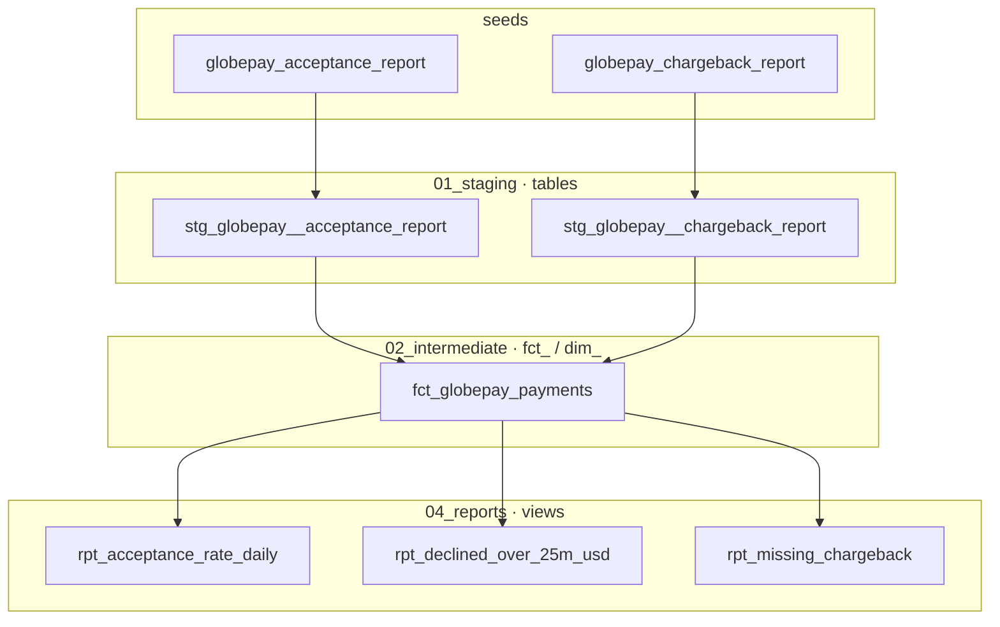

# Task - DBT Core

## Assignment

A Data Analyst at XXX has submitted a request for you to create a model to answer a few questions about payments. Three files have been provided in the request (can be found inside `/assignment_files/` subfolder) — however, no schema specifications were given.

### Part 1

For the first part of the challenge, please ingest and model the source data — try following the [dbt modeling standards](https://docs.getdbt.com/best-practices/how-we-structure/1-guide-overview?version=2).

1. Please include a document with information around:
   1. Preliminary data exploration
   2. Summary of your model architecture
   3. Lineage graphs
   4. Tips around macros, data validation, and documentation

### Part 2

For the second part of the challenge, please develop a production version of the model for the Data Analyst to utilize. This model should be able to answer these three questions at a minimum:

1. What is the acceptance rate over time?
2. List the countries where the amount of declined transactions went over $25M
3. Which transactions are missing chargeback data?

In addition to presenting the model, please provide the code (pseudo-code also suffices) for answering these questions. Feel free to provide the code, the actual answers, a brief description for the analyst, and any charts or images to help with the explanation.

---

## Local MVP notes

Minimal dbt Core project: load one seed into Snowflake `$DB_DEV` via Okta SSO.

**Auth reality check:** `$DBT_TECH_USER` is Okta SSO only (no password). `authenticator: externalbrowser` needs a real browser → **run dbt locally for this MVP**.

All connection values live in `.envrc` — do not hardcode them in docs or commands.

---

## Layout

```
Task - DBT Core/
├── .envrc
├── README.md
├── assignment_files/          # original challenge inputs
└── dbt/
    ├── Dockerfile
    ├── profiles.yml
    ├── dbt_project.yml
    ├── macros/utils.sql       # dw_modified_at, seed_value_to_boolean
    ├── seeds/
    │   ├── globepay_acceptance_report.csv
    │   ├── globepay_chargeback_report.csv
    │   └── _seeds.yml
    └── models/
        ├── 01_staging/        # tables
        ├── 02_intermediate/   # fct_ / dim_ tables
        ├── 03_marts/          # empty (.gitkeep) — unused in this assignment
        └── 04_reports/        # views (Q1–Q3)
```

---

## Data modeling

### Lineage



Folder prefixes `01_`…`04_` mirror build order / data flow in the repo tree. Not CommonMark — GitHub / GitLab / Cursor preview render `mermaid` fences; a raw `.md` dump will not.

### Layer responsibilities

| Layer | Materialization | Role |
|---|---|---|
| `01_staging` | incremental MERGE | Rename/cast/parse; hash-based `dw_created_at` / `dw_modified_at` |
| `02_intermediate` | incremental MERGE | `fct_globepay_payments` — watermark = max(`source_dw_modified_at`) |
| `03_marts` | — | Empty (`.gitkeep`). No extra grain vs the fact; unused in this assignment |
| `04_reports` | **view** | Thin answers to Part 2 questions |

No `dim_` tables: only 6 countries / 5 currencies. Prefix is reserved if a real dimension appears later.

### Schemas

All layers (seeds + staging + intermediate + marts + reports) land in **one** schema: `$DBT_SCHEMA` from `.envrc` (`profiles.yml` → `schema`). No `+schema` on folders, no `generate_schema_name` override.

**For this test assignment: do not split layers into different schemas.** Lineage is already in `01_`…`04_` folders. Extra schemas would need grants plus a `generate_schema_name` that *replaces* the target schema — default dbt concatenates and you get `$DBT_SCHEMA_staging`, not `staging`.

Prod-style split (`raw` / `staging` / `marts` / `reports`) is for RBAC (“analysts see marts only”). Overkill here.

### Key business rules

- Grain: one row per `transaction_id` (`external_ref`)
- `amount` treated as **major** currency units (CSV has decimals; API “minor units” text is ignored)
- `amount_usd = amount / rates[currency]` (`rates` JSON = units of currency per 1 USD, `USD=1`)
- Missing chargeback: no chargeback row **or** null `has_chargeback` after join (current seeds → empty Q3)

### `dw_modified_at` + incremental staging

Seed is still a **full replace**. Incremental is still useful on staging if we MERGE by ID and only bump timestamps when the **business-change hash** changes.

Both staging models are `incremental` / `unique_key: transaction_id` / `incremental_strategy: merge` / `merge_exclude_columns=['dw_created_at']` (SELECT always emits `current_timestamp()` for create; MERGE UPDATE does not overwrite it).

`record_hash` uses Snowflake `HASH(...)` with `COALESCE(..., '__NULL__')`:

- acceptance: `report_status`, `transaction_state`, `provider_event_id`
- chargeback: `report_status`, `has_chargeback`

Columns not in the hash can change without bumping `dw_modified_at`.

| Case | `dw_created_at` | `dw_modified_at` |
|---|---|---|
| First build (`is_incremental()` false) | `current_timestamp()` | `current_timestamp()` |
| New ID | now | now |
| Same ID + same hash | keep | keep |
| Same ID + different hash | keep | now |
| ID in staging, gone from seed | **not applied** (no deletes) | stale row remains |

`fct_globepay_payments` is also `incremental` / `merge` on `transaction_id`. Two clocks:

| Column | Meaning | Used as watermark? |
|---|---|---|
| `source_dw_modified_at` | `greatest(acceptance, chargeback).dw_modified_at` | **yes** — `stg.dw_modified_at > max(this.source_dw_modified_at)` |
| `dw_modified_at` | fact write time (`current_timestamp()`) | no (audit) |
| `dw_created_at` | first insert; MERGE UPDATE skipped | no |

Do **not** apply the watermark as a filter on each join source (that drops the unchanged side and can fake missing chargeback). Incremental steps:

1. IDs where acceptance **or** chargeback `dw_modified_at` > `max(source_dw_modified_at)`
2. Re-read **full** current rows for those IDs from both staging tables
3. MERGE the joined result
4. `source_dw_modified_at` = `greatest(...)` (advances the watermark)
5. `dw_modified_at` = now (this MERGE)
6. `dw_created_at`: SELECT always now; MERGE UPDATE skips it (`merge_exclude_columns`)

Deletions still not applied (stale fact row if ID vanishes from staging).

### `backfill_days` — partial replay without `--full-refresh`

**Reviewers: this is the incremental ops hook.** Default incremental is watermark-only (`dw_modified_at`). A late logic fix (e.g. FX / state mapping) should not require rebuilding the whole fact if only recent business days matter.

`vars.backfill_days` in `dbt_project.yml` (default **0**). Used only when `> 0`, and only on the **acceptance** side of `changed` (`transaction_date` lives there; chargeback has no event date). Those IDs are then re-read **in full** from both staging tables and MERGEd — same as a watermark hit.

```bash
# watermark only (default)
dbt run --select fct_globepay_payments

# replay last 365 calendar days of transaction_date + any watermark hits
dbt run --select fct_globepay_payments --vars 'backfill_days: 365'
dbt build --select fct_globepay_payments+ --vars '{"backfill_days": 365}'
```

On this assignment seed (2019 dates) you need a large N (or `--full-refresh`) to actually hit rows. The pattern is what matters: **technical watermark ∪ optional business window**, CLI-overridable, no full table rebuild.

`--full-refresh` remains the tool for schema change, dropped IDs, or a complete restatement.

Reports stay views (always see latest fact).

Switching an existing table from `table` → `incremental` needs one `--full-refresh` (then `dbt run` MERGEs):

```bash
dbt run --full-refresh --select stg_globepay__acceptance_report stg_globepay__chargeback_report fct_globepay_payments
```

`--full-refresh` is also how you drop IDs that disappeared from the seed.

Helpers in `macros/utils.sql`: `dw_modified_at()`, `seed_value_to_boolean()` (TRUE/FALSE lists; anything else → NULL, caught by `not_null` tests).

**Delivered in `04_reports/` views** — answers and analyst notes are at the end of this README (Part 2 answers).

---

## Initial setup

### direnv (one-time)

```bash
# install
curl -sfL https://direnv.net/install.sh | bash

# hook zsh (once)
grep -q 'direnv hook zsh' ~/.zshrc || echo 'eval "$(direnv hook zsh)"' >> ~/.zshrc
source ~/.zshrc

# allow this project (run from this Task - DBT Core folder)
direnv allow
direnv status
```

Confirm vars from `.envrc`:

```bash
echo "$SF_ACCOUNT $DBT_TECH_USER $SF_ROLE $SF_WAREHOUSE $DB_DEV $DBT_SCHEMA"
echo "$DBT_PROFILES_DIR $DBT_PROJECT_DIR"
```

Edit `.envrc` if role/warehouse/account differ from your Snowflake access, then `direnv allow` again.

Example `.envrc` (values masked — real file is gitignored):

```bash
# direnv: auto-loads when you cd into this directory
# Setup once: https://direnv.net/ — then: direnv allow

# --- identity ---
export MY_FIRST_NAME="<first>"
export MY_LAST_NAME="<last>"

# --- Snowflake connection (SSO / Okta) ---
# Account form: org-account (from URL app.snowflake.com/<org>/<account>/)
export SF_ACCOUNT="<account>"
export DBT_TECH_USER="<user>"
export SF_ROLE="<role>"
export SF_WAREHOUSE="<warehouse>"
export DB_DEV="<_YOUR_DEV_DATABASE>"
export DBT_SCHEMA="<schema_for_seeds>"

# --- dbt local paths ---
# profiles.yml lives next to the project; do NOT rely on ~/.dbt for this task
export DBT_PROFILES_DIR="$(pwd)/dbt"
export DBT_PROJECT_DIR="$(pwd)/dbt"

# --- later: Docker / key-pair (unused for SSO MVP) ---
# export SNOWFLAKE_PRIVATE_KEY_PATH=""
# export DBT_PASSWORD=""
```

| Var | Purpose |
|---|---|
| `SF_ACCOUNT` | Snowflake account (`org-account` from URL) |
| `DBT_TECH_USER` | Snowflake user (SSO) |
| `SF_ROLE` | Role to assume |
| `SF_WAREHOUSE` | Warehouse |
| `DB_DEV` | Target development database |
| `DBT_SCHEMA` | Target schema for seeds/models |
| `DBT_PROFILES_DIR` | Directory containing `profiles.yml` |
| `DBT_PROJECT_DIR` | dbt project root |

If SSO fails with opaque auth errors, lock `$SF_ACCOUNT` / `$DBT_TECH_USER` spelling and reuse the same values every run (SSO cache is keyed by `account::user`).

---

### Local dbt (Mac, one-time)

Prefer a venv (keeps system Python clean). Run from this Task - DBT Core folder:

```bash
# Python 3.12 only. 3.13/3.14 pull a different dbt-core and break pins.
python3.12 -m venv .venv
source .venv/bin/activate
python -m pip install pip==24.3.1
python -m pip install dbt-core==1.9.4 dbt-snowflake==1.9.4

dbt --version
# expect: dbt-core 1.9.4 / dbt-snowflake 1.9.4
```

Notes:
- Exact pins. Do **not** use `>=` / `~=` — Snowflake CLI / newer dbt-core will overwrite `snowflake-connector-python` and `click`.
- Re-activate later with: `source .venv/bin/activate` (and stay in this folder so direnv loads).
- If you already mixed packages in this venv: `deactivate 2>/dev/null`, `rm -rf .venv` and recreate.

`.venv/` is already in `.gitignore`.

---

### Smoke-test Snowflake SSO (optional, before dbt)

**Skip this entire section if you want.** Step 3 `dbt debug` opens the same Okta browser flow. Use this only if you want to prove Snowflake access *without* dbt in the loop.

What this checks: `$SF_ACCOUNT` / `$DBT_TECH_USER` / `$SF_ROLE` / `$SF_WAREHOUSE` / `$DB_DEV` from `.envrc` actually work with `externalbrowser`.

#### Install Snowflake CLI (once) — **separate venv**

Do **not** `pip install` this into `.venv`. Latest `snowflake-cli` wants `snowflake-connector-python==4.x` + `click==8.1.8`; `dbt-snowflake==1.9.4` wants connector `<4`. Same venv = the conflict you just hit.

```bash
python3.12 -m venv .venv-snow
source .venv-snow/bin/activate
python -m pip install pip==24.3.1
python -m pip install snowflake-cli==3.10.0

snow --version
# expect: Snowflake CLI version: 3.10.0
```

`.venv-snow/` is gitignored. Homebrew (`brew install snowflake-cli`) is also fine — isolated binary, not the dbt venv.

#### Run the query (Task - DBT Core root, direnv loaded)

`--temporary-connection` (`-x`) avoids needing `~/.snowflake/config.toml`.

```bash
source .venv-snow/bin/activate   # not .venv

# fail fast if direnv didn't load
: "${SF_ACCOUNT:?}" "${DBT_TECH_USER:?}" "${SF_ROLE:?}" "${SF_WAREHOUSE:?}" "${DB_DEV:?}" "${DBT_SCHEMA:?}"

snow sql --temporary-connection \
  --account "$SF_ACCOUNT" \
  --user "$DBT_TECH_USER" \
  --authenticator externalbrowser \
  --role "$SF_ROLE" \
  --warehouse "$SF_WAREHOUSE" \
  --database "$DB_DEV" \
  --schema "$DBT_SCHEMA" \
  -q "select current_user() as user, current_role() as role, current_database() as db, current_warehouse() as wh, current_schema() as sch"
```

Expected:
1. Browser opens → Okta login for `$DBT_TECH_USER`.
2. One row: user / role / db / warehouse / schema match the `.envrc` values.

If the browser never opens, you are in Docker/SSH/headless — stop; this MVP is host-only.

Then continue to **Project execution**.

### Docker — not in this MVP

Production would run dbt in Docker with a **technical user + password** (non-interactive). We do not have that user for this MVP — only Okta SSO / `externalbrowser`, which cannot run headless.

So Docker is the next step for a production implementation: CI builds the image by `COPY`ing this project folder into the image.

---

## Project execution

Source CSVs live in `assignment_files/`; dbt seeds (snake_case) are:

- `dbt/seeds/globepay_acceptance_report.csv`
- `dbt/seeds/globepay_chargeback_report.csv`

All layers land in `$DB_DEV.$DBT_SCHEMA` (one schema — see Data modeling).

### Activate + debug

From the Task - DBT Core root. If you ran the optional Snowflake CLI smoke-test, `.venv-snow` is still active — switch back:

```bash
deactivate 2>/dev/null
source .venv/bin/activate
which dbt
# expect: .../Task - DBT Core/.venv/bin/dbt

echo "$DB_DEV $DBT_SCHEMA $DBT_PROFILES_DIR"
cd "$DBT_PROJECT_DIR"

dbt debug
# → browser Okta login once; expect "All checks passed!"

dbt compile
```

### Seed

```bash
dbt seed --select globepay_acceptance_report globepay_chargeback_report

# reload if tables already exist
dbt seed --full-refresh --select globepay_acceptance_report globepay_chargeback_report
```

Expected relations:

- `$DB_DEV.$DBT_SCHEMA.globepay_acceptance_report`
- `$DB_DEV.$DBT_SCHEMA.globepay_chargeback_report`

### Verify seeds in Snowflake

```sql
-- substitute $DB_DEV / $DBT_SCHEMA from .envrc
select count(*) as n from <DB_DEV>.<DBT_SCHEMA>.globepay_acceptance_report;
select count(*) as n from <DB_DEV>.<DBT_SCHEMA>.globepay_chargeback_report;
-- expect 5430 rows each (header excluded)

select * from <DB_DEV>.<DBT_SCHEMA>.globepay_acceptance_report limit 5;
select * from <DB_DEV>.<DBT_SCHEMA>.globepay_chargeback_report limit 5;

-- join key sanity
select
        count(*) as acceptance_rows,
        count(c.external_ref) as matched_chargeback_rows
    from <DB_DEV>.<DBT_SCHEMA>.globepay_acceptance_report a
        left join <DB_DEV>.<DBT_SCHEMA>.globepay_chargeback_report c
            on a.external_ref = c.external_ref;
```

Useful resets:

```bash
dbt clean
dbt seed --full-refresh --select globepay_acceptance_report globepay_chargeback_report
```

### Build + test models

```bash
cd "$DBT_PROJECT_DIR"
dbt run
dbt test

dbt show --select rpt_acceptance_rate_daily --limit 10
dbt show --select rpt_declined_over_25m_usd
dbt show --select rpt_missing_chargeback
```

Expected:

- `rpt_declined_over_25m_usd` → FR, UK, AE, US (with `amount/rates[currency]` USD logic)
- `rpt_missing_chargeback` → 0 rows on current seeds

### Checklist

1. `direnv status` + `echo $SF_ACCOUNT $DBT_PROFILES_DIR`
2. `dbt --version`
3. `dbt debug` — All checks passed
4. `dbt seed` row counts (~5430 each) + join match on `external_ref`
5. Any type/quote issues on `rates` or `amount`
6. `dbt run` / `dbt test` + report `dbt show` results
7. Role/warehouse/account corrections in `.envrc` (if any)

---

## Part 2 answers

Views in `04_reports/` (always current — they read `fct_globepay_payments`). One row per payment; declined $ are USD (`amount / rates[currency]`). Details in **Data modeling**.

| # | Question | View | Logic |
|---|---|---|---|
| 1 | Acceptance rate over time | `rpt_acceptance_rate_daily` | `accepted_count / total_count` by `transaction_date` |
| 2 | Countries with declined amount over $25M | `rpt_declined_over_25m_usd` | `sum(amount_usd) filter is_declined` > 25e6 |
| 3 | Transactions missing chargeback data | `rpt_missing_chargeback` | `is_missing_chargeback` (no CB row or null flag) |

```sql
-- substitute $DB_DEV / $DBT_SCHEMA from .envrc
select * from <DB_DEV>.<DBT_SCHEMA>.rpt_acceptance_rate_daily
order by transaction_date;

select * from <DB_DEV>.<DBT_SCHEMA>.rpt_declined_over_25m_usd
order by declined_amount_usd desc;

select * from <DB_DEV>.<DBT_SCHEMA>.rpt_missing_chargeback;
```

### Q1 — acceptance rate over time

Daily is the right grain (seed spans 2019-01-01 → 2019-06-30, ~181 days). Roll up in a worksheet if you want week/month:

```sql
select date_trunc('month', transaction_date) as month
     , sum(accepted_count) / sum(total_count) as acceptance_rate
from <DB_DEV>.<DBT_SCHEMA>.rpt_acceptance_rate_daily
group by 1
order by 1;
```

`is_accepted` = `transaction_state = 'ACCEPTED'`. Denominator is all payments that day (accepted + declined).

### Q2 — declined > $25M by country

`$` → settle in USD: `amount_usd = amount / rates[currency]` (`USD=1`). Not original-currency sums.

On the provided seeds (same FX rule):

| `country_code` | declined USD (approx.) | in view? |
|---|---|---|
| FR | ~32.6M | yes |
| UK | ~27.5M | yes |
| AE | ~26.3M | yes |
| US | ~25.1M | yes |
| CA | ~18.4M | no |
| MX | ~0.9M | no |

`UK` is kept as in the file (not ISO `GB`).

### Q3 — missing chargeback data

**0 rows on these seeds.** Acceptance and chargeback are 1:1 on `transaction_id`, and `has_chargeback` is always TRUE/FALSE.

Empty view is the answer, not a bug. The flag is still modeled so a later extract with orphans / nulls shows up without a code change.

---
